# Temat projektu

**Planer Podróży AI** to nowoczesna aplikacja webowa służąca do błyskawicznego, automatycznego generowania spersonalizowanych planów wycieczek. Aplikacja jest przeznaczona dla osób, które cenią swój czas i szukają gotowych rozwiązań podróżniczych bez konieczności wielogodzinnego przeszukiwania internetu.

### 1. Jaki problem rozwiązuje nasza aplikacja?
Planowanie podróży jest procesem żmudnym, wymagającym przeglądania wielu różnych stron internetowych: blogów podróżniczych w poszukiwaniu atrakcji, wyszukiwarek lotów oraz portali rezerwacyjnych hoteli. Nasza aplikacja rozwiązuje ten problem, agregując to wszystko w jednym miejscu za pomocą jednego kliknięcia.

### 2. Czym nasza aplikacja się wyróżnia?
Większość planerów AI generuje jedynie suchy tekst z atrakcjami. Nasza aplikacja łączy potężny model językowy AI (LLaMA-3.3-70b) do tworzenia szczegółowego, godzinowego planu dnia, z integracją danych w czasie rzeczywistym z Google Flights i Google Hotels (przez SerpApi). Użytkownik otrzymuje więc nie tylko pomysł na wyjazd, ale od razu konkretne loty z cenami i oferty hotelowe.

---

## Uruchomienie projektu (developer)

| Technologia / Narzędzie | Wersja | Link |
| :--- | :--- | :--- |
| **PHP** | `8.5.3` | [php.net](https://www.php.net/) |
| **Laravel Framework** | `13.12.0` | [laravel.com](https://laravel.com/) |
| **Composer** | `2.9.4` | [getcomposer.org](https://getcomposer.org/) |
| **SQLite** | `3.40.0` | [sqlite.org](https://www.sqlite.org/) |
| **FilamentPHP (Panel Admina)** | `5.6.6` | [filamentphp.com](https://filamentphp.com/) |
| **Tailwind CSS** | `3.4.17` (via CDN) | [tailwindcss.com](https://tailwindcss.com/) |

### Wymagania programowe

Aplikacja jest wysoce przenośna. Do uruchomienia projektu w trybie deweloperskim wymagane są:
* **System operacyjny:** Windows 10/11, macOS, lub Linux.
* **Środowisko uruchomieniowe:** PHP w wersji 8.5.3 lub nowszej.
* **Menedżer pakietów:** Composer w wersji 2.9.4 lub nowszej.
* **Baza danych:** Wbudowany sterownik SQLite (nie wymaga instalacji zewnętrznego serwera bazy danych jak MySQL).
* *Uwaga:* Projekt nie wymaga instalacji Node.js ani środowiska NPM, ponieważ framework Tailwind CSS jest ładowany bezkompilacyjnie przez oficjalny CDN, co znacznie upraszcza uruchomienie.

### Proces instalacji

Otwórz terminal (konsolę) i wykonaj poniższe kroki:

1. Pobierz projekt na swój komputer:
```bash
git clone [https://github.com/KonradF20/Projekt_AI.git](https://github.com/KonradF20/Projekt_AI.git)
cd Projekt_AI
```

2. Zainstaluj niezbędne pakiety PHP:
```bash
composer install
```

### Proces konfiguracji

**1. Zmienne środowiskowe i klucze API:**
Skopiuj plik `.env.example` i zmień jego nazwę na `.env`. Następnie otwórz go w edytorze kodu i uzupełnij klucze integracji API (bez nich generowanie planów nie zadziała). Upewnij się również, że połączenie z bazą jest ustawione na `DB_CONNECTION=sqlite`.

Aby aplikacja mogła pobierać dane ze świata rzeczywistego, musisz wygenerować dwa darmowe klucze API. Zajmie to mniej niż 2 minuty:

> **Jak uzyskać klucz GROQ_API_KEY (Sztuczna Inteligencja)?**
> 1. Wejdź na stronę [console.groq.com](https://console.groq.com/).
> 2. Zaloguj się (możesz użyć konta Google).
> 3. W menu po lewej stronie wybierz zakładkę **"API Keys"**.
> 4. Kliknij przycisk **"Create API Key"**, nadaj mu dowolną nazwę (np. "Planer") i kliknij "Submit".
> 5. Skopiuj wygenerowany ciąg znaków (zaczynający się od `gsk_...`) i wklej go do pliku `.env` jako wartość `GROQ_API_KEY`.

> **Jak uzyskać klucz SERPAPI_KEY (Loty i Hotele z Google)?**
> 1. Wejdź na stronę [serpapi.com](https://serpapi.com/).
> 2. Kliknij przycisk **"Register"** i załóż darmowe konto.
> 3. Po zalogowaniu i zweryfikowaniu maila, zostaniesz przeniesiony na swój Dashboard (Panel Główny).
> 4. Po prawej stronie ekranu znajdziesz pole **"Your Private API Key"**. 
> 5. Skopiuj ten klucz i wklej go do pliku `.env` jako wartość `SERPAPI_KEY`.

Gotowy plik `.env` w tej sekcji powinien wyglądać tak:
```env
DB_CONNECTION=sqlite
GROQ_API_KEY="gsk_tutaj_twoj_dlugi_klucz_z_groq"
SERPAPI_KEY="tutaj_twoj_dlugi_klucz_z_serpapi"
```

**2. Wygenerowanie klucza aplikacji:**
```bash
php artisan key:generate
```

**3. Inicjalizacja bazy danych i danych testowych:**
Utwórz pusty plik o nazwie `database.sqlite` w folderze `database/`. Następnie uruchom migracje, które zbudują strukturę tabel i wstrzykną dane początkowe:
```bash
php artisan migrate --seed
```
*Dane logowania dla wygenerowanego konta Administratora:*
* **E-mail:** `admin@test.pl`
* **Hasło:** `admin`

*Dla normalnego użytkownika należy utworzyć własne konto.*

**4. Dowiązanie symboliczne dla zdjęć (Wymagane dla panelu admina):**
```bash
php artisan storage:link
```

**5. Uruchomienie projektu:**
```bash
php artisan serve
```
Aplikacja będzie dostępna w przeglądarce pod adresem: `http://localhost:8000` (lub opcjonalnie pod wirtualną domeną lokalną przy użyciu narzędzi takich jak Laragon).

---

## Uruchomienie projektu (user)

Aplikacja ma formę serwisu webowego. Użytkownik końcowy nie musi niczego instalować. 
* Aby rozpocząć korzystanie, wystarczy uruchomić nowoczesną przeglądarkę internetową (np. Google Chrome, Mozilla Firefox, Safari) na dowolnym urządzeniu (komputer, tablet, smartfon) i wejść pod podany adres URL (np. `http://localhost:8000` w przypadku testów lokalnych).
* **Wymagania sprzętowe:** Dowolne urządzenie z dostępem do internetu. Ze względu na korzystanie z zewnętrznych API oraz zaawansowanych animacji CSS, zalecane jest stabilne połączenie sieciowe.

---

## Podręcznik użytkownika

### Główne ścieżki użytkownika (User Flow)

**1. Dynamiczne Warianty Strony Głównej**

System automatycznie rozpoznaje stan sesji oraz poziom uprawnień użytkownika na poziomie warstwy middleware Laravel, serwując jeden z trzech dedykowanych widoków strony głównej:

* **Wariant A: Widok Gościa (Niezalogowany)**
  Gdy użytkownik wchodzi na stronę po raz pierwszy, system inicjuje domyślny stan autoryzacji (`@guest`). Górny pasek nawigacyjny oferuje przyciski "Zaloguj się" oraz "Załóż konto". Na środku ekranu pojawia się czysty formularz wyszukiwania oraz sekcja *Empty State* zachęcająca do podania kryteriów podróży.
  
  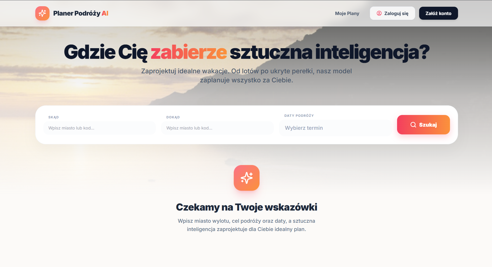
  > *Opis: Stan początkowy aplikacji dla użytkownika bez aktywnej sesji.*

* **Wariant B: Widok Zalogowanego Użytkownika**
  Po pomyślnym zalogowaniu, system niszczy widok gościa i przebudowuje nagłówek strony (`@auth`). W prawym górnym rogu dynamicznie wstrzykiwane jest imię zalogowanego użytkownika pobrane bezpośrednio z bazy danych, ikona przejścia do edycji profilu oraz przycisk wylogowania. Wyszukiwarka pozostaje w pełni aktywna i gotowa do przyjmowania zapytań.
  
  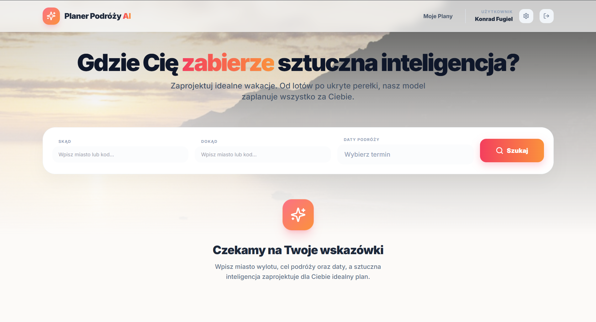
  > *Opis: Strona główna z aktywnym kontekstem zalogowanego użytkownika.*

* **Wariant C: Widok Administratora**
  Gdy do systemu loguje się użytkownik z adresem `admin@test.pl`, funkcja `isAdmin()` w modelu `User` zwraca wartość `true`. Na tej podstawie system całkowicie ukrywa formularz wyszukiwania podróży, aby administrator nie zużywał limitów API. W zamian generowany jest dedykowany panel informacyjny informujący o trybie zarządzania z przyciskiem bezpośredniego przekierowania do panelu administracyjnego.
  
  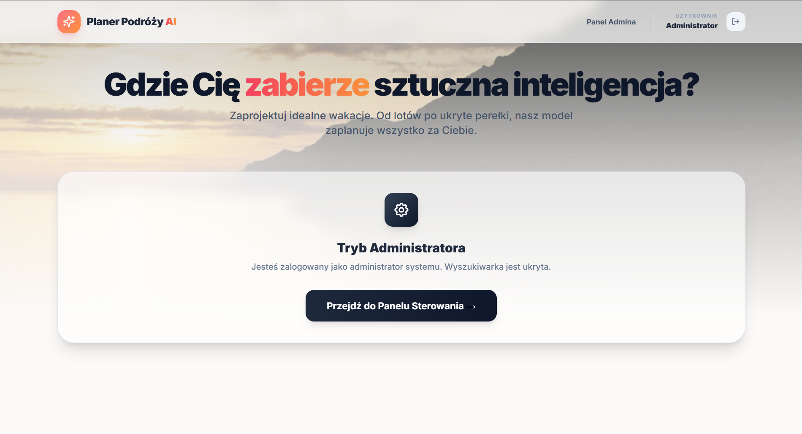
  > *Opis: Bezpieczny widok powitalny przeznaczony wyłącznie dla konta zarządzającego.*

**2. Proces Uwierzytelniania i Rejestracji**

Autoryzacja w aplikacji została zaprojektowana w technologii asynchronicznej (AJAX/Fetch API). Kliknięcie przycisków w nagłówku nie przeładowuje strony, lecz wywołuje animowane okno modalne z rozmytym tłem (*backdrop-blur*).

* **Tworzenie konta (Rejestracja):** Użytkownik wypełnia formularz. Po kliknięciu "Utwórz konto", skrypt JavaScript przechwytuje dane i wysyła je do trasy `/register`. Klasa `RegisterRequest` sprawdza unikalność adresu e-mail oraz minimalną długość hasła (8 znaków). W przypadku sukcesu użytkownik jest automatycznie logowany, a strona odświeża się, przechodząc w stan zalogowany.
  
  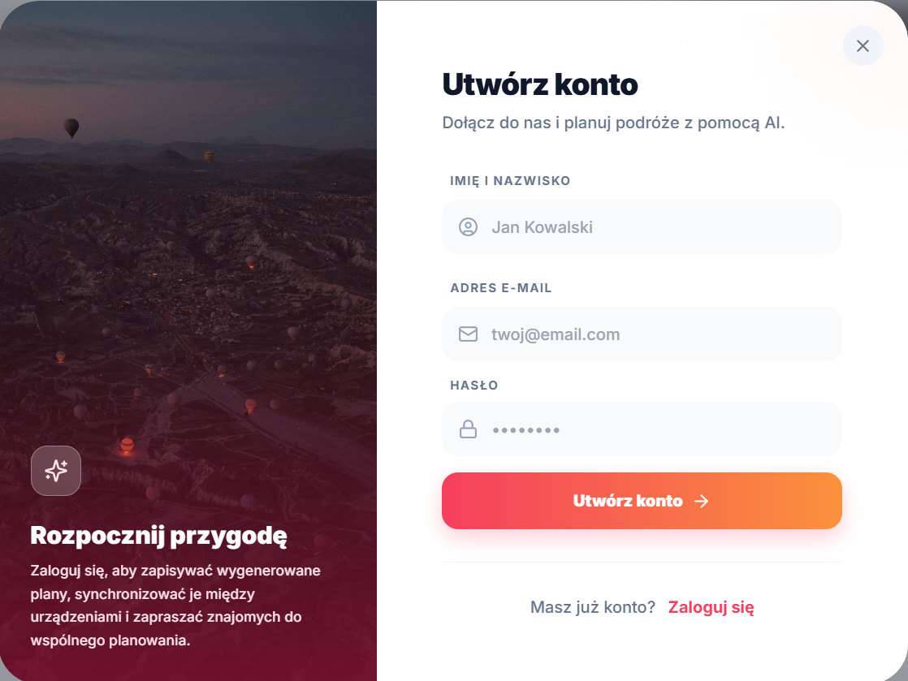
  > *Opis: Interfejs rejestracji z dedykowaną grafiką i walidacją pól w czasie rzeczywistym.*

* **Logowanie do systemu:** Jeśli użytkownik posiada już konto, klika przycisk "Zaloguj się", co powoduje dynamiczne przełączenie widoku modala (ukrywane jest pole tekstowe z imieniem). Dane trafiają do klasy `LoginRequest`, która za pomocą metody `Auth::attempt()` weryfikuje dane z bazą SQLite.
  
  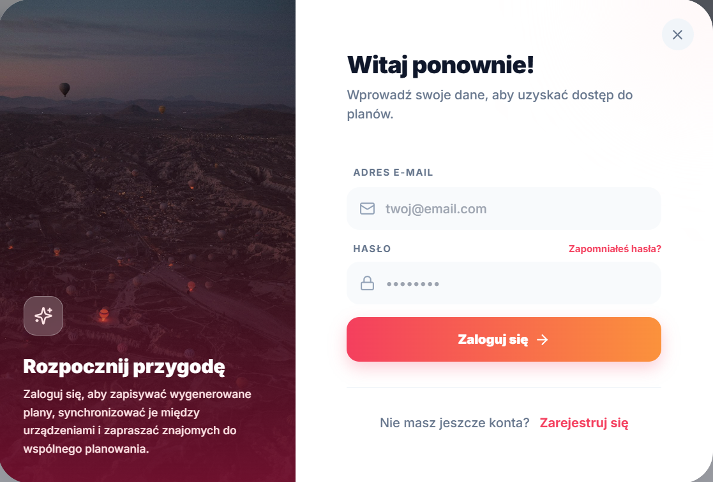
  > *Opis: Modal logowania obsługujący asynchroniczne sprawdzanie poprawności haseł.*

* **Wymuszenie logowania (Zabezpieczenie):** Jeśli nieautoryzowany gość spróbuje wpisać dane w wyszukiwarkę i kliknie "Szukaj", system zablokuje wykonanie kodu, automatycznie wysunie modal logowania i wyświetli czerwony komunikat informujący o konieczności posiadania konta, dbając o bezpieczeństwo budżetu API.

**3. Proces Planowania i Pracy z Sztuczną Inteligencją**

To serce aplikacji, łączące zaawansowane skrypty frontendowe z zewnętrznymi interfejsami API.

* **Krok 1: Wyszukiwanie i kodowanie IATA** Podczas wpisywania celu podróży, system uruchamia bibliotekę *Tom Select* połączoną z publiczną bazą danych lotnisk. Użytkownik nie musi znać skomplikowanych oznaczeń lotniczych – wpisując np. "Lizbona", system automatycznie podpowiada i podstawia międzynarodowy kod IATA (LIS). Chroni to aplikację przed błędami użytkownika (literówkami).
  
  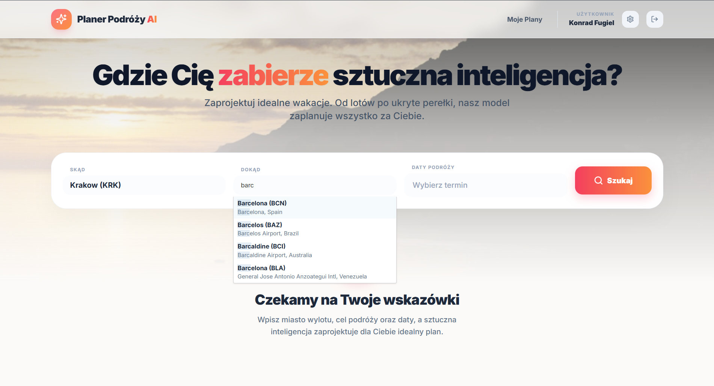
  > *Opis: Mechanizm inteligentnego podpowiadania i standaryzacji nazw lotnisk.*

* **Krok 2: Asynchroniczny proces generowania (Loading State)** Po kliknięciu przycisku "Szukaj", formularz główny zostaje natychmiast ukryty w strukturze DOM. System uruchamia animowany cykl ładowania (*loading spinner*). W tym czasie backend wykonuje trzy zadania: wysyła zapytanie strukturalne do modelu LLaMA na platformie Groq, parsuje daty i wysyła zapytania do SerpApi po aktualne loty i hotele.
  
  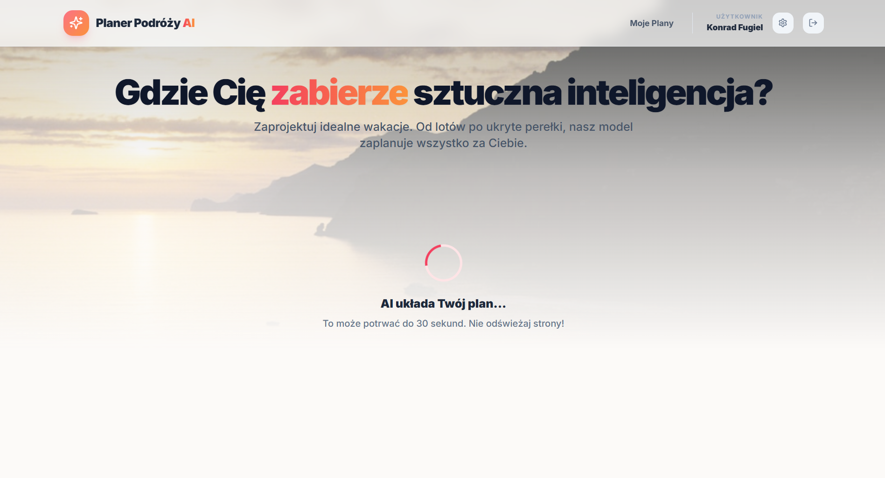
  > *Opis: Ekran blokujący interfejs na czas wykonywania zapytań sieciowych (do 30 sekund).*

**4. Prezentacja i Interakcja z Wynikami Podróży**

Po odebraniu kompletnych odpowiedzi z zewnętrznych serwerów, ekran ładowania znika, a system renderuje komponent `travel-results.blade.php`.

* **Agregacja ofert rynkowych (API):** Aplikacja prezentuje kafelki zawierające logotyp linii lotniczej, dokładne godziny wylotu i lądowania, czas trwania lotu, liczbę przesiadek oraz aktualną najniższą cenę w PLN pobraną z Google Flights. Obok wyświetlana jest propozycja najlepiej ocenianego hotelu w tym samym terminie wraz z jego miniaturą i ceną za cały pobyt. Oba kafelki są klikalnymi linkami, które przenoszą użytkownika bezpośrednio do rezerwacji.
  
  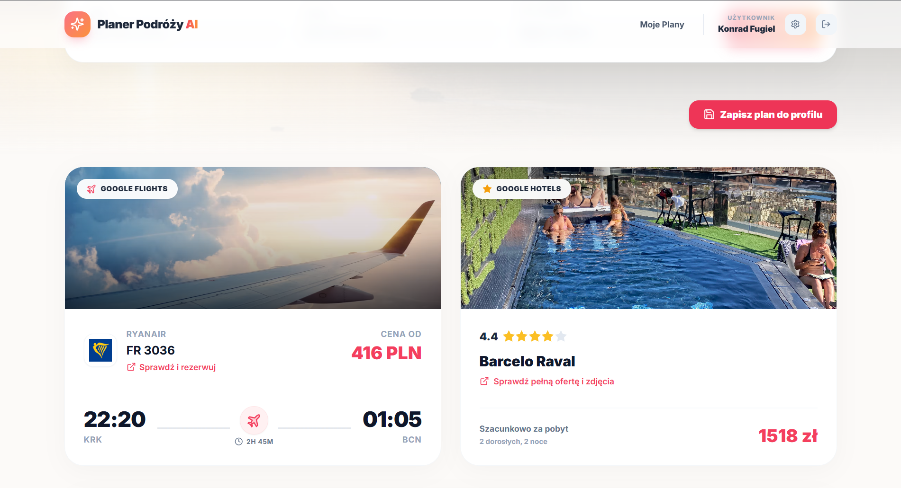
  > *Opis: Wizualna prezentacja rzeczywistych danych logistycznych pobranych przez SerpApi.*

* **Interaktywna Oś Czasu (AI):** Poniżej wyświetlany jest szczegółowy plan wycieczki przygotowany przez sztuczną inteligencję. System oblicza liczbę dni i generuje poziomą listę zakładek. Kliknięcie na dany dzień (np. Dzień 2) uruchamia prostą, ultrawydajną funkcję JavaScript `switchDay()`, która ukrywa poprzednie atrakcje i pokazuje nowe bez ponownego przeładowywania strony i obciążania serwera. Na każdy dzień zaplanowane jest dokładnie 6 szczegółowych aktywności.
  
  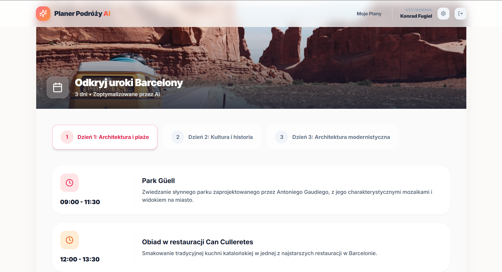
  > *Opis: Widok harmonogramu dnia zarządzany po stronie klienta (Client-Side Rendering).*

**5. Panel Użytkownika (Zapis i Zarządzanie)**

Każdy wygenerowany plan jest tymczasowy. Aby zachować go na stałe, użytkownik korzysta z systemu zarządzania bazą danych (CRUD):

* **Zapisywanie planu (Create):** Kliknięcie przycisku "Zapisz plan do profilu" uruchamia trasę `/save-plan`. System serializuje tablice PHP z planem dnia, lotami oraz hotelem do formatu tekstowego JSON i zapisuje je w tabeli `travel_plans` pod unikalnym ID użytkownika. Następuje przekierowanie z zielonym komunikatem sukcesu.
  
  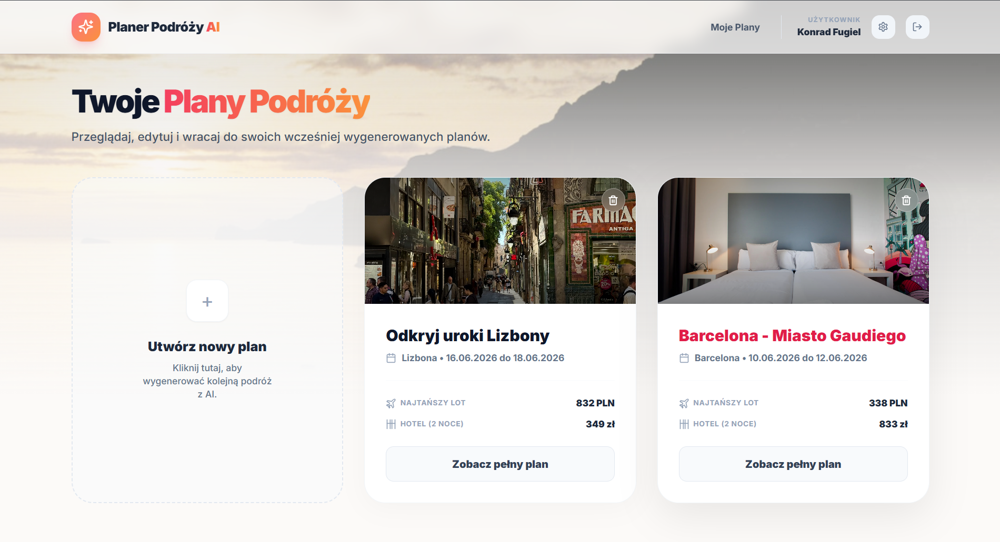
  > *Opis: Pulpit użytkownika prezentujący archiwalne podróże z podsumowaniem kosztów wyciągniętych z JSON.*

* **Odczyt archiwalnych danych (Read):** Kliknięcie przycisku "Zobacz pełny plan" na dowolnym kafelku wywołuje trasę `/moje-plany/{id}`. Kontroler pobiera dane, dokonuje automatycznego rzutowania typu (*Json Casts*) z powrotem na tablice PHP i renderuje dokładnie ten sam widok, który użytkownik widział po wygenerowaniu, zachowując pełną interaktywność osi czasu.
  
  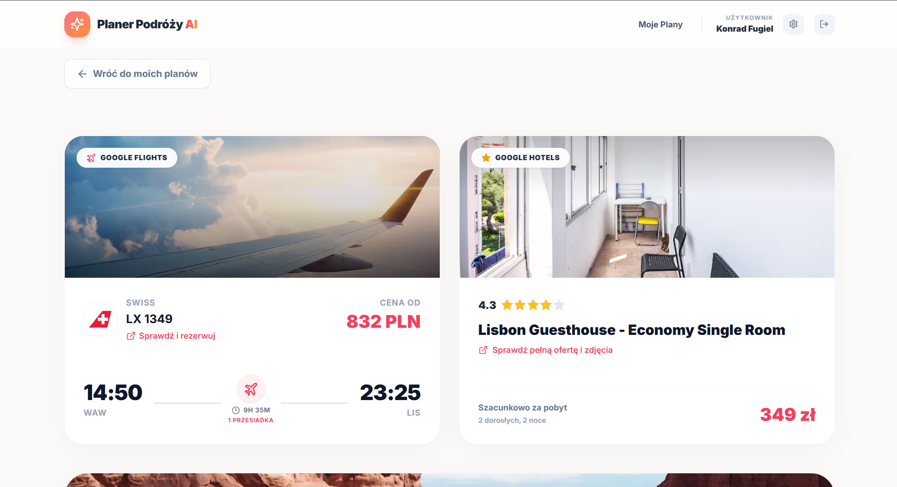
  > *Opis: Widok podglądu zapisanego planu wywołany z bazy SQLite.*

* **Bezpieczne usuwanie planu (Delete):** Aby zapobiec utracie danych przez przypadkowe kliknięcie, naciśnięcie ikony kosza na kafelku nie usuwa go od razu. System wywołuje okno modalne z ostrzeżeniem. Dopiero po kliknięciu "Tak, usuń", aplikacja wysyła asynchroniczne żądanie metodą `DELETE` za pomocą JavaScript `fetch()`. Po pomyślnej odpowiedzi z serwera, kafelek planu płynnie znika z ekranu za pomocą animacji zmniejszania skali (`scale-90`) i przezroczystości, po czym jest usuwany ze struktury HTML.
  
  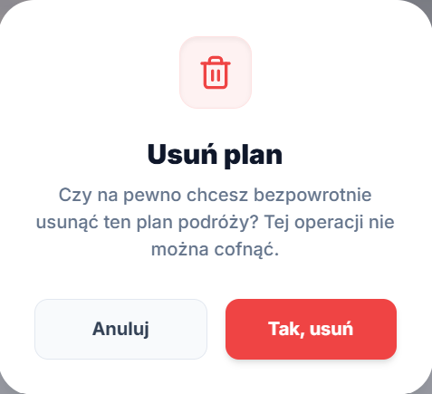
  > *Opis: System dwustopniowego potwierdzania destrukcji rekordu z bazy danych.*

* **Ustawienia zabezpieczeń konta:** W zakładce profilu użytkownik ma możliwość zmiany hasła. Klasa `UpdatePasswordRequest` dba o to, aby system sprawdził za pomocą wbudowanej reguły Laravel (`current_password`), czy użytkownik podał poprawne stare hasło, zanim pozwoli na zapisanie nowego, zaszyfrowanego algorytmem bcrypt hasła w bazie danych.
  
  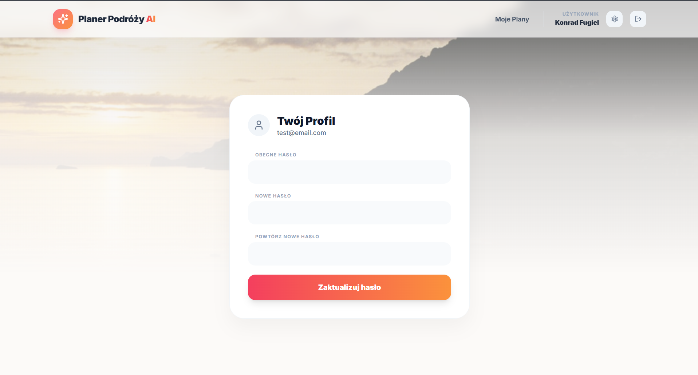
  > *Opis: Formularz zmiany hasła z rygorystyczną walidacją wsteczną.*

**6. Pełny Panel Administratora (FilamentPHP CRUD)**

Dla celów nadzorczych, administrator systemu ma dostęp do odizolowanego, zabezpieczonego interfejsem `FilamentUser` panelu pod adresem `/admin`. Zaimplementowano tu kompletny system CRUD dla tabeli użytkowników i planów.

* **Baza Użytkowników (Read & Index):** Główny pulpit wyświetla wszystkich zarejestrowanych w systemie użytkowników w formie zaawansowanej tabeli. System automatycznie obsługuje stronicowanie (paginację) oraz pozwala na natychmiastowe przeszukiwanie użytkowników po imieniu lub adresie e-mail bezpośrednio z poziomu zapytania SQL.
  
  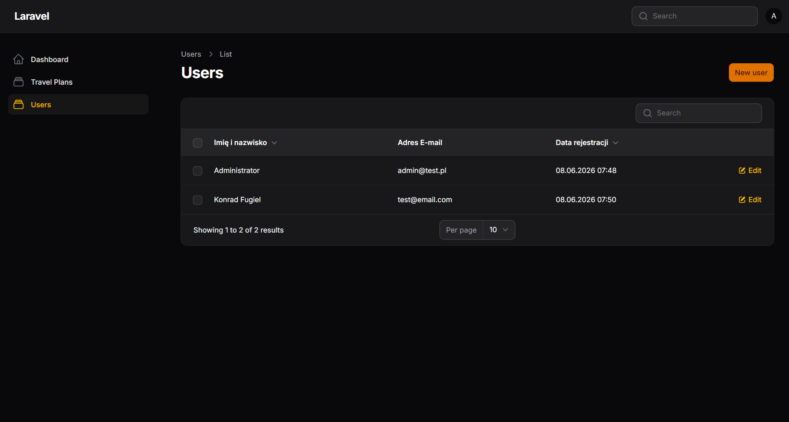
  > *Opis: Globalna lista użytkowników w panelu administracyjnym FilamentPHP.*

* **Dodawanie użytkownika z poziomu panelu (Create):** Administrator może ręcznie utworzyć nowe konto w systemie. Formularz korzysta z architektury `UserForm`. Wprowadzone hasło jest automatycznie przechwytywane i szyfrowane w tle przed zapisem (`dehydrateStateUsing`), gwarantując najwyższe standardy bezpieczeństwa.
  
  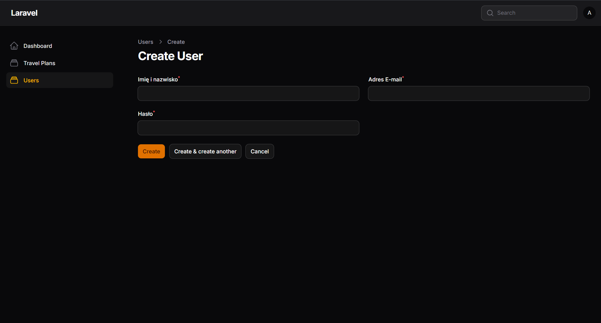
  > *Opis: Formularz bezpiecznego tworzenia konta przez administratora.*

* **Modyfikacja i czyszczenie bazy (Update & Delete):** Kliknięcie przycisku "Edit" otwiera pełną edycję rekordu. Administrator może zmienić dane użytkownika lub całkowicie usunąć go z bazy danych przyciskiem "Delete", co dzięki kaskadowemu usunięciu w bazie danych (`cascadeOnDelete`) automatycznie wyczyści wszystkie plany podróży powiązane z tym użytkownikiem, nie pozostawiając w bazie danych osieroconych rekordów.
  
  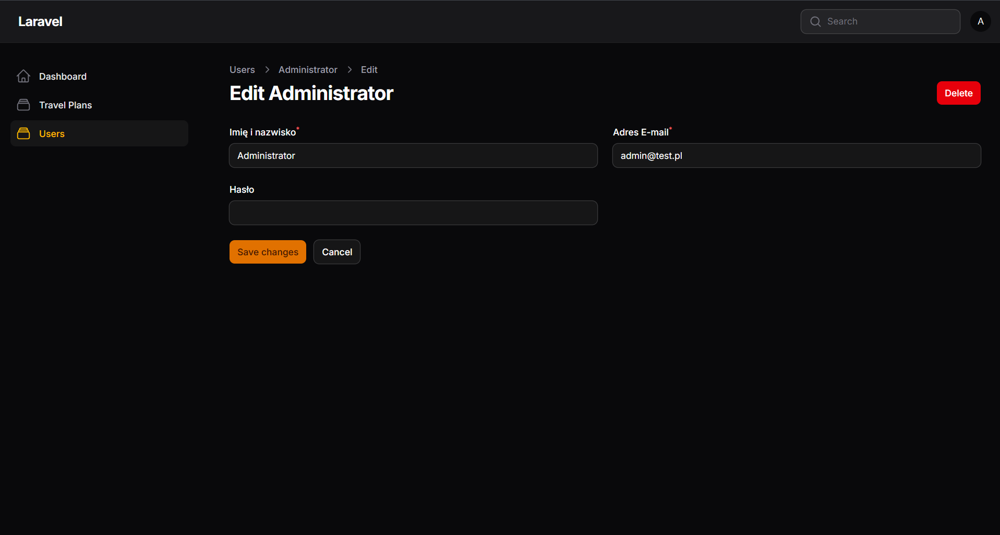
  > *Opis: Widok modyfikacji i usuwania danych użytkownika.*

**7. Responsywność Systemu (RWD)**

Aplikacja została zaprojektowana zgodnie z filozofią *Mobile-First* przy użyciu klas responsywnych frameworka Tailwind CSS (modyfikatory `sm:`, `md:`, `lg:`). 

Gdy system wykryje mniejszą rozdzielczość ekranu (np. smartfon), górne menu nawigacyjne oraz formularze wyszukiwania płynnie adaptują się do formatu pionowego. Elementy interfejsu układają się w strukturę jednokolumnową, dotykowe przyciski ulegają powiększeniu dla wygody obsługi kciukiem, a marginesy boczne zostają automatycznie zwężone, zapewniając pełną czytelność wygenerowanych planów podróży na dowolnym urządzeniu mobilnym.

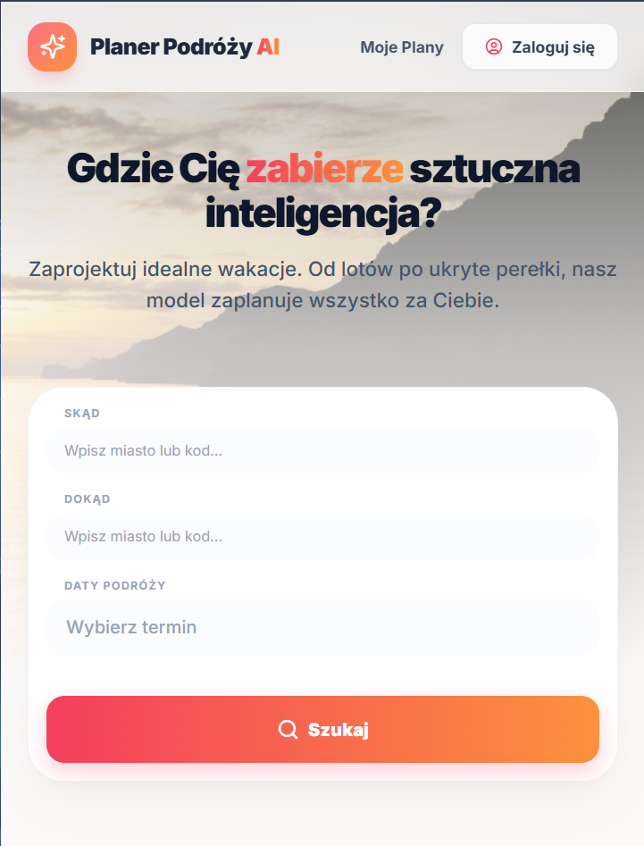
> *Opis: Wygląd strony głównej oraz formularza wyszukiwania na ekranie smartfona.*

### Role w systemie
* **Gość:** Może przeglądać stronę główną, włączyć wyszukiwarkę, ale system poprosi go o zalogowanie przed wysłaniem zapytania do AI.
* **Zalogowany Użytkownik:** Może generować nieskończoną ilość planów, przeglądać je w panelu "Moje Plany", usuwać je bezpowrotnie oraz zmieniać swoje hasło w ustawieniach profilu.
* **Administrator:** Zamiast wyszukiwarki widzi na stronie głównej baner kierujący do Panelu Administracyjnego. Może zarządzać całą bazą użytkowników oraz globalnie edytować / usuwać wszystkie wygenerowane plany (np. wgrywając do nich niestandardowe zdjęcia z dysku).

### Przypadki brzegowe i bezpieczeństwo
1.  **Zabezpieczenie budżetu AI:** System zapobiega wysyłaniu absurdalnych zapytań. Jeśli użytkownik wybierze w kalendarzu wyjazd na 3 miesiące, backend przycina ramy planowania w modelu AI do maksymalnie 10 dni.
2.  **Brak połączeń / Hoteli:** Gdy system nie znajdzie odpowiednich lotów z wybranego miasta, aplikacja nie wyrzuca błędów (tzw. Exception), lecz wyświetla w interfejsie elegancki "Empty State" informujący o braku lotów, nie blokując obejrzenia samej wycieczki.
3.  **Cicha walidacja IATA:** Backend obsługuje długie nazwy z wyszukiwarki (np. "Atlanta (ATL)"), parsuje je do AI i rozkodowuje z powrotem na samo miasto bez przerywania działania.

### Przechowywane dane
System wykorzystuje nowoczesne metody przetrzymywania informacji:
* **Tabela `users`:** Szyfrowane hasła, adresy e-mail.
* **Tabela `travel_plans`:** Oprócz standardowych relacji klucza obcego (`user_id`), wykorzystano zaawansowane przechowywanie strukturalne w kolumnach JSON (`days`, `flight_data`, `hotel_data`), co pozwala na bezstratne rzutowanie tablic bezpośrednio do widoków Blade.

---

## Plany rozbudowy

Projekt posiada stabilne i kompletne fundamenty (tzw. MVP), jednak istnieje ogromny potencjał do rozbudowy w "v2.0":
1.  **Cache'owanie zapytań do API:** Wdrożenie bazy Redis w celu zapamiętywania zapytań do API (aby np. wyszukanie lotu "Warszawa -> Rzym" na ten sam termin przez drugiego użytkownika nie zużywało naszych tokenów API, lecz wczytywało się z lokalnego cache).
2.  **System generowania PDF:** Dodanie biblioteki (np. `Dompdf`) pozwalającej na pobranie wygenerowanego planu jako estetycznego pliku PDF na telefon.
3.  **Udostępnianie planów (Social):** Wprowadzenie publicznych linków (tzw. slugów) umożliwiających podsyłanie planów znajomym bez konieczności zakładania przez nich konta.
4.  **Rozbudowa modułu pakowania:** Zapisywanie stanu spakowanej walizki do bazy danych (obecnie funkcja JavaScript ułatwia pakowanie, ale stan resetuje się po odświeżeniu strony).
